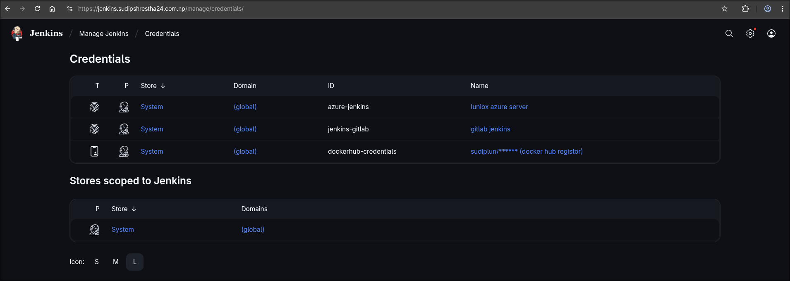
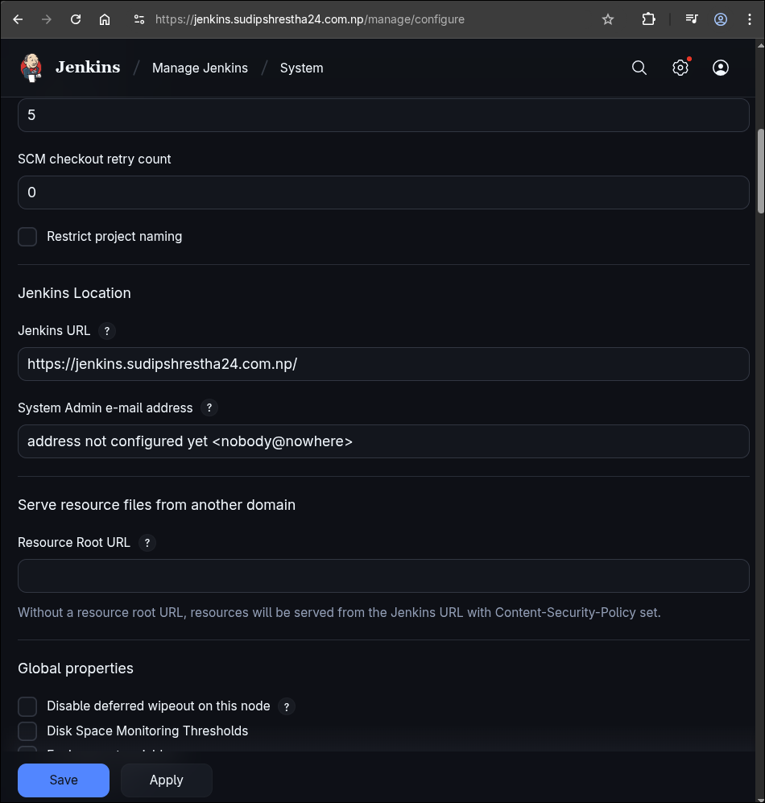
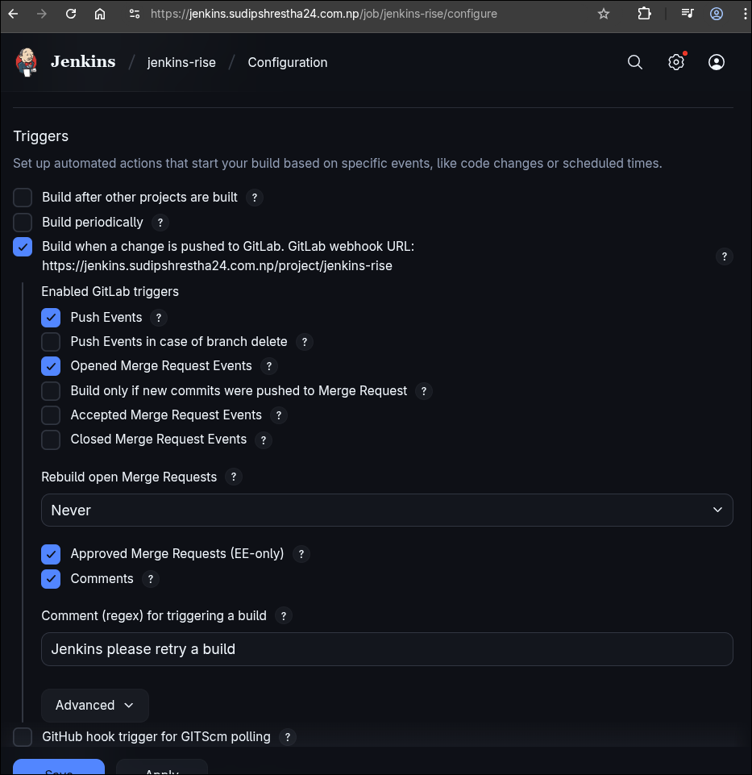
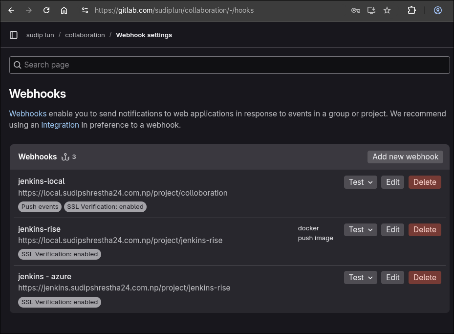
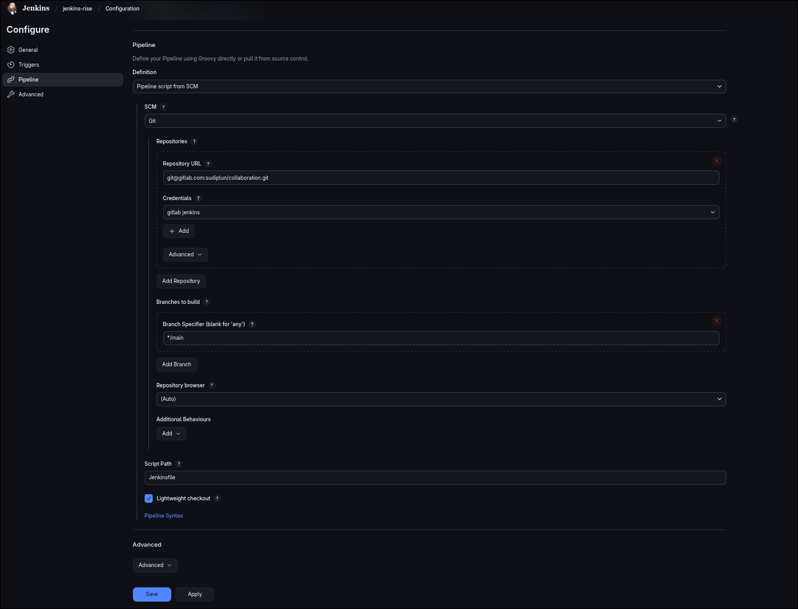
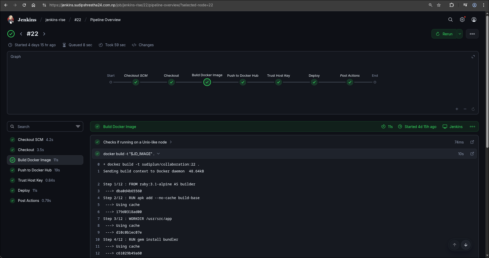

# CI/CD Pipeline with Jenkins, Docker, and Ansible

This document outlines the process for setting up a Continuous Integration and Continuous Deployment (CI/CD) pipeline using Jenkins. The pipeline automates the deployment of this project by building a Docker image, pushing it to Docker Hub, and then deploying the container to a remote server using Ansible.

## Overview

The pipeline is designed to automatically trigger on changes to the `main` branch of the GitLab repository. Here's a summary of the workflow:

1.  **Source Code Management:** Code is hosted on GitLab.
2.  **Continuous Integration:** Jenkins pulls the latest code from the repository.
3.  **Build:** A Docker image is built inside a Jenkins container.
4.  **Push:** The newly built image is pushed to Docker Hub.
5.  **Deployment:** Ansible runs a playbook to deploy the Docker container on the target server.

---

## 1. Prerequisites

Before you begin, ensure you have the following:
*   A running Jenkins instance.
*   A server accessible via SSH where the application will be deployed.
*   A Docker Hub account.
*   A GitLab account with a repository for the project.

---

## 2. Jenkins Setup

### 2.1. Required Plugins

Install the following plugins in Jenkins from **Manage Jenkins > Plugins**:

- `Ansible plugin`
- `Docker Pipeline`
- `Docker Commons Plugin`
- `GitLab`
- `Pipeline`

### 2.2. Credentials Configuration

You need to add the following credentials to Jenkins at **Manage Jenkins > Credentials**.

-   **Server SSH Key:** An SSH private key to allow Ansible to connect to your deployment server.
-   **GitLab Credentials:** A GitLab Personal Access Token or SSH key to allow Jenkins to pull code from your repository.
-   **Docker Hub Credentials:** Your Docker Hub username and password for pushing the container image.

---

## 3. Webhook Configuration

To enable automatic pipeline triggers on code changes, you need to set up a webhook between GitLab and Jenkins.

**Step 1: Get Jenkins Webhook URL**

First, ensure your Jenkins URL is correctly configured in **Manage Jenkins > System**.

Next, open your Jenkins pipeline job, go to the **Build Triggers** section, and find the GitLab webhook URL. You will also need to generate a secret token here.

**Step 2: Add Webhook to GitLab**

In your GitLab repository, go to **Settings > Webhooks**. Paste the URL and the secret token from Jenkins to create the webhook.

---

## 4. Jenkins Pipeline

Create a new **Pipeline** job in Jenkins. In the pipeline configuration, point it to your GitLab repository. The pipeline script (`Jenkinsfile`) should be located in the root of your repository.

*For more details on the repository structure, see the [project's GitLab repository](https://gitlab.com/sudiplun/collaboration/-/tree/main?ref_type=heads).*

### Pipeline Overview

The pipeline consists of several stages that build, push, and deploy the application.

